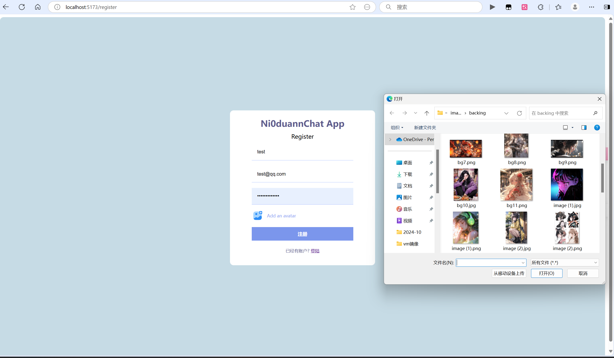
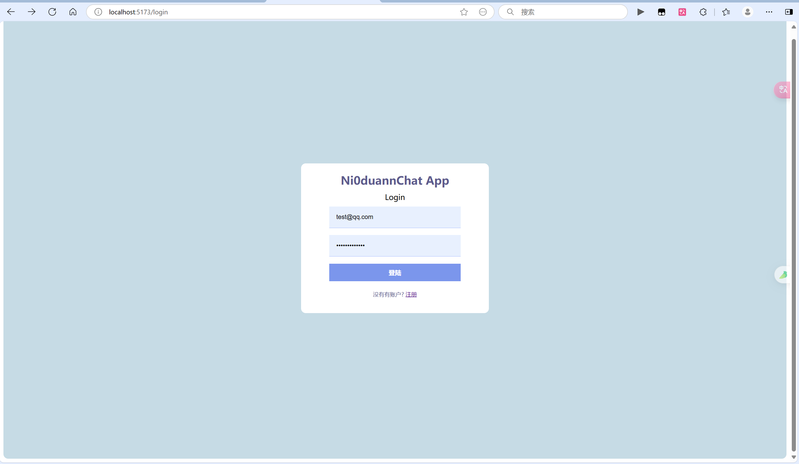
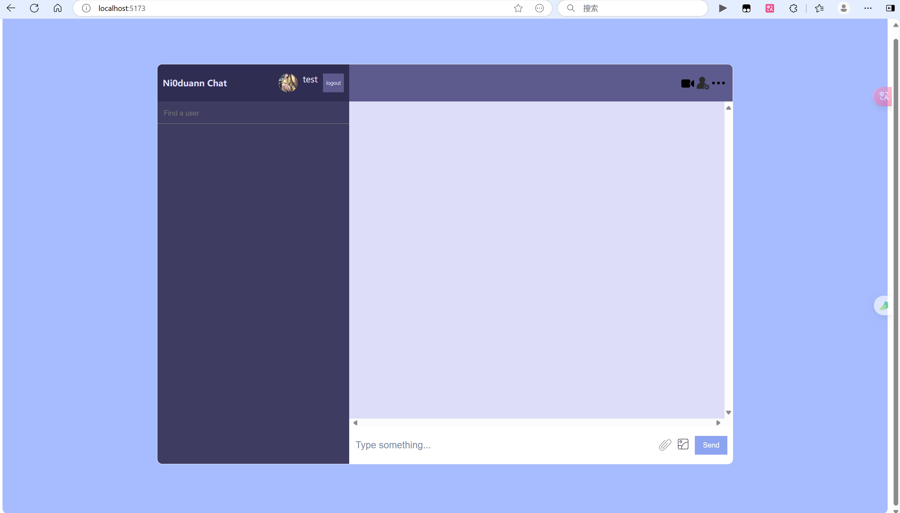
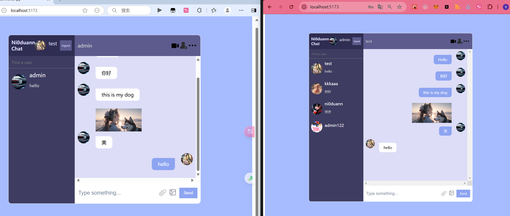

## 如何运行

#####  配置环境

```
pnpm install
```

##### 启动项目

```
pnpm run dev
```

##### 打开项目地址

```
http://localhost:5173/
```

## 项目展示

##### 注册账号并上传头像



##### 登陆账号



##### 进入聊天界面



##### 选择好友进行交流

